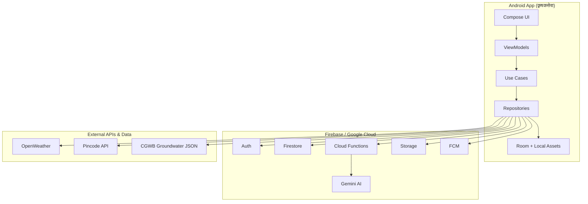

# कृषकसेवा (Krishak Seva) — Project Write-up

**Smart Water, Crop & Advisory System**

---

## 1. The Problem

Indian farmers make daily decisions about water, crops, and plant health with little expert support. Most digital tools are English-only, spread across different apps, and do not work well on weak village networks.

Key challenges:

- **When to irrigate** — wrong timing wastes water and money
- **Which crop to grow** — season, soil, and groundwater must match
- **Disease detection** — late diagnosis can destroy a harvest
- **No local expert** — agronomists are not available in every village
- **Language barrier** — farmers in Telugu regions need advice in their own language

In Andhra Pradesh and Telangana, many farmers use borewells in districts where groundwater is already stressed. Generic crop advice that ignores local water levels can push water-intensive crops where they should not be grown.

---

## 2. Your Solution

**कृषकसेवा** is an Android app that gives farmers personalized farming advice from one simple dashboard — in English or Telugu.

The farmer registers once with pincode, village, farm size, soil, water source, and current crop. The app then provides:

- **Dashboard** — weather, water score, crop health, irrigation tip, and alerts
- **Smart crop recommendation** — Kharif / Rabi / Zaid suggestions using AI and district groundwater data
- **Weather advisory** — 5-day forecast and irrigation guidance
- **Crop Doctor** — scan a leaf photo to detect disease and get treatment steps
- **Voice advisor** — ask farming questions by voice or text; get spoken answers
- **Push notifications** — alerts for weather, irrigation, and crop risks

The app works offline with cached data and local fallbacks when the network is weak. AI runs securely in the cloud — API keys are never stored on the phone.

---

## 3. Tools & Data Used

**Mobile app**
- Kotlin, Jetpack Compose, Material 3, CameraX, Room, Hilt

**Backend & cloud**
- Firebase Auth, Firestore, Cloud Functions, Firebase Storage, FCM, App Check
- Google Gemini API (crop advice, weather tips, disease vision, voice Q&A)

**APIs**
- OpenWeather — current weather and forecast
- India Post Pincode API — auto-fill location from pincode
- Open-Meteo — geocoding and backup weather

**Open data**
- OpenCity.in — CGWB Ground Water Resources India 2022 (Andhra Pradesh & Telangana, 59 districts)
- Bundled in the app as district-level groundwater categories (Safe, Semi-critical, Critical, Over-exploited)

---

## 4. Architecture Diagram

**Flow:** The farmer uses the Android app → app sends profile, photos, or questions to Firebase Cloud Functions → Gemini generates advice → result is shown on screen and cached locally for offline use.
